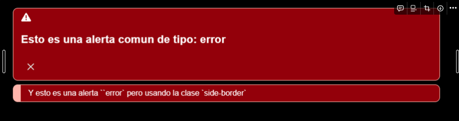
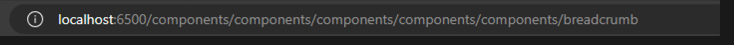
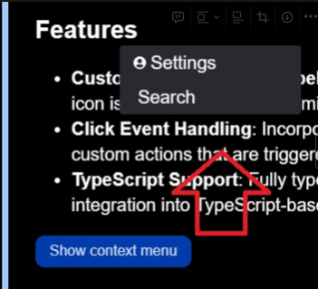
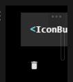
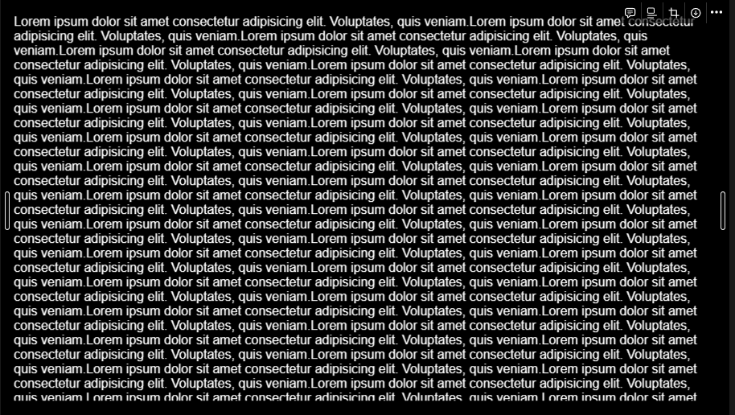
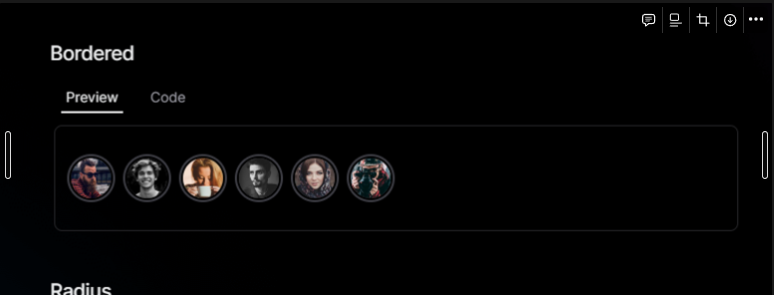
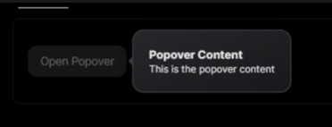
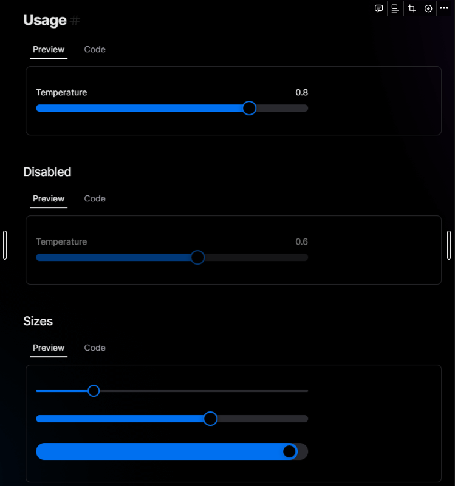
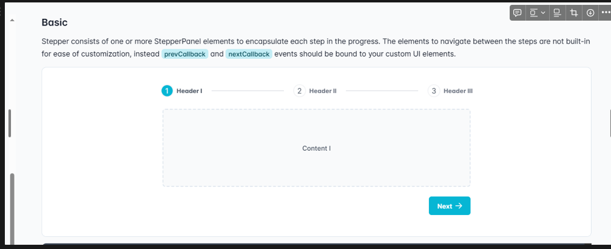

## ***`Lista de Componentes que no funcionan bien`*** 🛑

### Alert :

- Alert principal presenta un problema visual y estructura en su contenido interior, muestra en una columna 3 filas, haciendolo ver poco apreciable y no aprovecha bien los espacios que puede estar todo en una linea.

---

### Breadcrumb :

- Al dar click muchas veces en un enlace en donde ya estemos, se va repitiendo la ruta en la ruta del navegador

---

### ButtonGroup :

- Propiedad “size" no cambia el tamanio de los botones
- La propiedad “orientation” no cambia la posicion de los botones

---
### **ContextMenu :**

- Al darle click, el contexto o cuadro del componente aparece en la parte superior de la pantalla y no se visualiza bien
    
    
    
- Ajustar la posicion donde aparece el dialog al darle click al boton de contexto, aparece juston en donde tenemos el cursor a la hora de darle click.

---

### Empty :

- Ajustar background o border-radius del componente
- Ajustar la alineacion y del contenido, icono y texto del empty
- agregar paddings

---

### **Switch :**

- La variante “danger” no se visualiza bien ni el color ni el componente.
    
 
    

---

### Icons :

- Cambiar variable de background para el icono con la clase circle ya que no se nota.
    
    
    

---

### Perfect ScrollBar :

- El componente no permite hacer scroll ni bajar la barra con el mouse

## ***`Sugerencias a integrar en Pragmate`***

### **Card :**

---

### Popover :

---

### Slider :

---

### **Stepper :**

